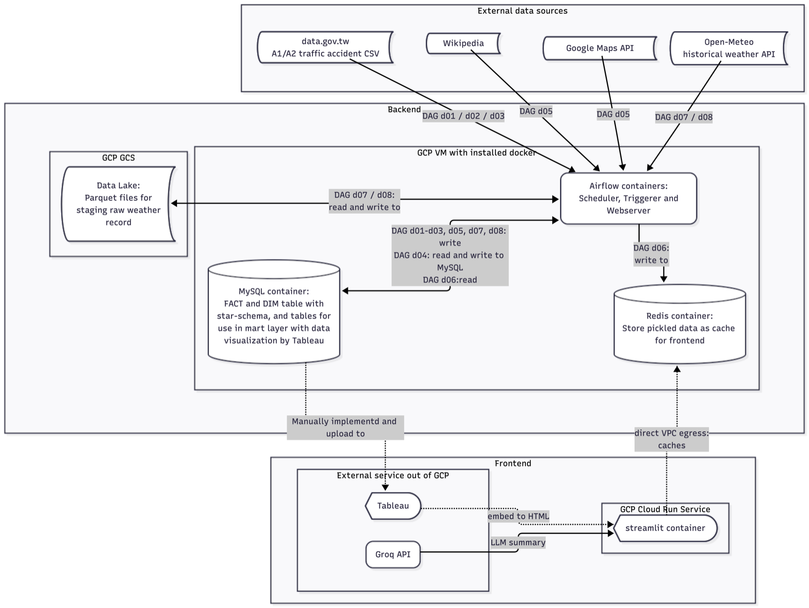

# 臺灣交通事故 ETL × 夜市周邊事故分析看板


  \


> 🌐 [English README](./README.md) ｜ **繁體中文**


## About
透過整合全台夜市地理資訊、歷年車禍事故數據與天氣觀測三地異質資料源，建立一套用數據驅動的交通風險量化評估儀表板，協助政府與大眾探查與識別「臺灣行人地獄」中的高風險熱區。
> 這個 repo 部分沿用[先前與同學協作的專案](https://github.com/CarlHung65/tjr104_t01)，
差別在於本 repo 的目的是**練習當時沒整合完成的 CI/CD 與 GCP Cloud Run Service 部署**，並在此之上持續重構，提升查詢與寫入效能、log 品質。

**實作大綱**：把臺灣政府公開資料集 data.gov.tw 的 A1／A2
交通事故資料、Open-Meteo 的天氣觀測資料、維基百科與 Google Maps 的夜市資訊，透過 7 條 Airflow
DAG 寫入 MySQL 的星狀綱要 (star schema)，另以 1 條 DAG 寫入 Redis 記憶體資料庫，提升前端 Streamlit 網頁呈現**夜市周邊的交通安全因子與風險層級**分析。

> [Live Demo](https://tjr104-tw-traffic-app-dev-219985522999.asia-east1.run.app/)

**運作概念**：
後端服務（含 MySQL、Redis、Airflow）以 Docker Compose 啟動後跑在 GCP VM 上，前端
Streamlit 打包成獨立 image 部署到 Cloud Run Service，透過 direct VPC egress 連回 VM 內網存取MySQL 與 Redis，兩個 GCP 資源均搭配 Github Actions 自動部署。ETL 拆成 `e_` 抓取、`t_` 清洗、`l_` 載入三個階段的純函式放在 `src/task/`，`dags/` 只負責串接與決定排程相依性。
資料模型採用[星狀綱要，五張事實表配四張維度表](https://dbdiagram.io/d/new_Traffic-69a10021a3f0aa31e1405268)，中英欄位對照集中在
`src/util/table_column_map.py`；[ERD 則參見連結](https://dbdiagram.io/d/new_Traffic-69a10021a3f0aa31e1405268)。

**設計要點**：
- 事故 ETL 採**全量載入**，每次抓回整份當年度資料，主鍵由「日編號、時間與經緯度」雜湊而來，以確保寫入 MySQL 任務的冪等性，歷年回補則以檔案批次為單位分批載入，不一次拉進記憶體。

- 夜市 ETL 採**全量載入**，「緯度、經度與營業星期」取成唯一鍵。Google Places API 的失敗
寫在回應內容的 `status` 欄位而非 HTTP 狀態碼，因此客製、自訂例外類別並區分暫時性與
永久性故障，只對暫時性故障重試，使額度不會浪費在重試必然失敗的請求上。

- 車禍地點天氣數據 ETL 則採**增量載入**，因為 Open-Meteo API 有請求額度限制，且因應事故 ETL 資料筆數
預計 4 百萬筆，若每次執行都全量載入會無端浪費額度。為實踐增量載入，將存下的氣象數據的
部分（「觀測點 × 月」）抽為 GCS 物件路徑名稱，以路徑名作為任務進度表，當 DAG 續跑或重試
時，只對缺失的路徑檔請求 API。清洗任務則透過**預先定義的同一支網格進位函式**，確保存入 MySQL 的天氣數據與事故數據可以對應到同一個地理網格、顆粒度相同，兩表 JOIN 永遠有交集。
此外，此設計也有助於減少 API 請求次數，一年約30萬~40萬計的事故座標進位後，簡化到千個觀測點，打 API 時也就相當於對應到數千的地理網格。

- 前端**調用的資料圖層**，例如夜市周邊事故的統計，由 DAG `d06` 預先從 MySQL 讀取後經過 Pandas 套件計算後寫進 Redis 作為快取層，前端頁面只讀快取；SQL 與 Pandas 的使用比重係根據本專案配給的雲端服務機器規格大小做過取捨，**以期 Cloud Run Service 啟動與運行期間除了冷啟動的等待時間之外，其他資料讀取與顯示都不會超過服務的記憶體配額、延遲圖層展開，達到較好的使用者體驗**。

## Feature

每條 DAG 都是一塊可獨立觸發的功能，DAG 檔只做串接，實際邏輯在 `src/task/` 對應的
`e_`／`t_`／`l_` 檔案：

| 功能 | 說明 | 排程 | 進入點 |
| ---- | ---- | ---- | ------ |
| 建表與全年度日曆 | 建立資料庫與[星狀綱要型的事故事實表與維度表](https://dbdiagram.io/d/new_Traffic-69a10021a3f0aa31e1405268)，然後為事故日維度表填值 | 手動，一次性 | DAG [`d01`](./dags/d01_create_calendar_this_year.py) |
| 今年度事故 ETL | 抓今年度 A1／A2 級別事故，依序載入三張維度表、事故主檔，最後寫入環境與當事人兩張事實表 | 每月 1、10、20 日 17:00 | DAG [`d02`](./dags/d02_track_recent_traffic_accidents.py) |
| 歷年事故回補 | 2021–2025 年同一套流程，五年份 65 個檔案分批載入，使記憶體負擔較小 | 手動 | DAG [`d03`](./dags/d03_track_hist_traffic_accidents.py) |
| mart 層重建 | 依序執行 `mart_table_sql/` 的 SQL 重建前端資料聚合結果，任一檔失敗即整批復原，使 mart 層不會停在半完成分析進度 | 每月 15 日 13:00 | DAG [`d04`](./dags/d04_analysis_pedestrian_accidents.py) |
| 夜市 ETL | 自維基百科取得夜市清單，再以 Google Maps 補上座標與營業時間 | 每月 15 日 11:00 | DAG [`d05`](./dags/d05_track_night_markets.py) |
| Redis 預計算 | 夜市周邊事故統計，算好放進快取供前端唯讀 | 每 5 天 20:00 | DAG [`d06`](./dags/d06_precompute_to_redis.py) |
| 今年度天氣 ETL | 自 Open-Meteo 抓取後暫存為 GCS Parquet 再載入 MySQL，以「觀測點 × 月」為續傳斷點 | 每月 3、18 日 07:00 | DAG [`d07`](./dags/d07_track_recent_weather.py) |
| 歷年天氣回補 | 2021–2025 年逐年回補 | 每日 09:00 **直到 DAG run 完全成功一次後手動 pause** | DAG [`d08`](./dags/d08_track_hist_weather.py) |

前端為 Streamlit 多頁應用，說明如下：

| 頁面 | 說明 | 檔案 |
| ---- | ---- | ---- |
| 首頁 | 各分頁導覽與入口 | [app.py](./src/app.py) |
| 全臺嚴重度分析 | 依地區、縣市、時間篩選夜市事故嚴重度 | [v_act1_all_accident.py](./src/pages/v_act1_all_accident.py) |
| 縣市比較 | 以縣市與夜市為單位做安全對標與年增率排名 | [v_act1_city_accident.py](./src/pages/v_act1_city_accident.py) |
| 單一夜市 AI 診斷 | 自訂半徑的周邊事故剖析，統計數字交由 Groq AI 生成防護建議 | [v_act1_single_accident.py](./src/pages/v_act1_single_accident.py) |
| 修法前後分析 | 以 Tableau 製作分析儀表板 | [v_act2_tableau.py](./src/pages/v_act2_tableau.py) |


## Tech. Stack

| Layer | 技術 | 目的 |
| ----- | ---- | ---- |
| 01 Frontend | Streamlit、Plotly、Folium／streamlit-folium、Pandas、Tableau Public embedding | 多頁看板、互動圖表與地圖 |
| 02 Ingestion & Parsing | Requests、BeautifulSoup4、Tenacity、data.gov.tw／Open-Meteo API／Google Maps API | 各來源抓取、解析與重試 |
| 03 Database & Storage | MySQL 8.0、GCS、SQLAlchemy、PyMySQL、Google cloud SDK | 事故與天氣關聯資料庫 (data layer)、資料湖做天氣數據的中繼落點 (staging layer) |
| 04 Cache | Redis 7、streamlit `cache_data` deep copy | 使頁面開啟不需直連 MySQL 做負荷重的大量運算，確保低延遲回應 |
| 05 Orchestration | Apache Airflow 3（with LocalExecutor） | 管理 DAG 的排程、相依與分批 |
| 06 Auth & Permissions | GCP Application Default Credentials、Service Account、IAP tunnel、GitHub Secrets | GCS 存取與 CI/CD 身分驗證 |
| 07 Hosting & Deployment | - 後端：GCP VM 與 docker container <br>- 前端：Cloud Run Service 與 Artifact Registry、direct VPC egress | 前後端分開部署做讀寫權限分離 |
| 08 AI | Groq API | [單一夜市頁面](./src/pages/v_act1_single_accident.py)的生成式防護建議 |
| 09 CI/CD & Version Control | - CI/CD：Git、GitHub Actions（`deploy-backend-vm` / `deploy-cloud-run`）<br>- Version Control： Poetry | 自動部署 VM 中容器、自動部署 Cloud Run Service。 |
| 10 Rate Limiting & Flow Control | - API 請求進度用 GCS 路徑名稱追蹤，作為增量載入判斷依據。<br>- 大容量事故資料串流載入 | 控制任務中斷續傳時不重新全量載入、控制記憶體負擔、I/O 負擔 |
| 11 Error Tracking & Logs | 自製 `logger_crtx` | 兼顧地端與雲端 logs 可讀性與 trackback |
| 12 Quality Gate | pytest（315 個測試）、Ruff、pre-commit、CI 測試 gate | 以靜態檢查與行為測試把關，測試沒過即擋下部署 |
| 13 Availability & Recovery | upsert、以業務邏輯計算雜湊值當主鍵 | 重試任務或是將檔案分批做 ETL 時仍確保資料寫入的冪等性 |


## Architecture



## Project Structure

```plaintext
taiwan_traffic_accidents/          # 專案根目錄
├── dags/                          # Airflow DAG，只做串接與排程
│   ├── d01_create_calendar_this_year.py
│   ├── d02_track_recent_traffic_accidents.py
│   ├── d03_track_hist_traffic_accidents.py
│   ├── d04_analysis_pedestrian_accidents.py
│   ├── d05_track_night_markets.py
│   ├── d06_precompute_to_redis.py
│   ├── d07_track_recent_weather.py
│   └── d08_track_hist_weather.py
├── src/
│   ├── app.py                     # Streamlit 進入點（首頁）
│   ├── pages/                     #   v_*.py 分頁，須與 app.py 同層
│   ├── task/                      # ETL 各階段的純函式，檔名前綴即階段
│   │   ├── e_*.py                 #   抓取，回傳檔案路徑 list
│   │   ├── t_*.py                 #   清洗，回傳 DataFrame
│   │   ├── l_*.py                 #   載入，寫進 MySQL
│   │   ├── create_*_tables.py     #   DDL for data layer tables
│   │   ├── mart_table_sql/        #   mart layer 純 SQL 腳本
│   │   ├── exec_mart_sql.py       #   執行 mart layer SQL 腳本
│   │   └── core/                  #   前端調用 Redis 資料與網頁渲染元件
│   │
│   └── util/                      # 七支共用工具
│       ├── mysql_utils.py         #   mysql 連線、update、upsert 工具
│       ├── redis_utils.py         #   redis 連線、set cache、get cache
│       ├── gcs_utils.py           #   GCS 連線、upload、download
│       ├── crawling_utils.py      #   通用型爬蟲工具
│       ├── read_traffic_accident_file.py  # 讀取事故 CSV
│       ├── paths.py               #   管理 ETL 任務腳本的執行目錄準確
│       ├── logger_crtx.py         #   共用 logger，不依賴執行環境
│       └── table_column_map.py    #   事故資料欄位名稱定義
├── test/unit_test/                # pytest 315 個測試（test_task_* / test_util_*）
├── docker/                        # Dockerfile.airflow、Dockerfile.streamlit
├── docker-compose.yml             # 啟動 MySQL、Redis 與 Airflow（後端 VM 一鍵啟動）
├── .github/workflows/             # deploy-backend-vm.yml、deploy-cloud-run.yml
├── .streamlit/config.toml         # Streamlit 設定
├── docs/adr/                      # 決策文（000N-<決策>.md）與執行摘要
├── data/                          # 存放爬下來的事故 CSV 與夜市資料 JSON，皆在 .gitignore，執行時透過 docker-compose bind mount
├── CONTEXT.md                     # 本專案涉及的領域術語表
├── CLAUDE.md                      # Claude Code 專案指引與決策索引
├── pyproject.toml / poetry.lock   # Poetry 依賴
└── requirements.txt               # poetry export 提供給 dockerfile
```

## Get Started

### 1. Clone 與環境建置

```bash
git clone --depth 1 https://github.com/Jessie-Lin-810630/taiwan_traffic_accidents_CICD_practice.git
cd taiwan_traffic_accidents_CICD_practice
```

依照使用目的擇一路徑：

#### 路徑 A：只想把後端整套跑起來

本機只需要安裝 Docker，本機不必裝 Python／Poetry。備妥根目錄 `.env`（見
[第 2 節](#2-環境變數)）之後：

```bash
docker compose up -d --build
```

會啟動 MySQL、Redis 與 Airflow（scheduler / triggerer / api-server）。Airflow UI 在
`http://<host>:8081`。

> **業務資料庫要手動建**：compose 的 MySQL image 只會在首次啟動時建一個庫，這個名額
> 已經留給 Airflow metadata。事故資料用的業務庫需**以 root 手動建立並授權**給 `MYSQL_USER`
> ，之後才能成功執行 DAG `d01` 中的 DDL。

#### 路徑 B：完整重現開發環境

適合要改程式碼的人。建議 Python >= 3.12、Poetry >= 2.x。

```bash
poetry env use <path-to-python-3.12+>
poetry install
```

`pyproject.toml` 已設定 `packages = [{include = "src"}]`，因此模組能以 `src.xxx`
絕對匯入。

---

### 2. 環境變數

```bash
cp .env.example .env      # cp 後於 .env 填入真實值
```

共 15 個變數：

- **Python 腳本需要 9 個**：`MYSQL_HOST`、`MYSQL_PORT`、`MYSQL_USER`、
  `MYSQL_PASSWORD`、`MYSQL_DATABASE`、`REDIS_HOST`、`REDIS_PORT`、
  `REDIS_PASSWORD`、`GOOGLE_MAP_API_KEY`、`GROQ_API_KEY`。
- **docker compose 啟動 AirFlow 容器額外需要 6 個**：`MYSQL_AIRFLOW_DATABASE`、`MYSQL_ROOT_PASSWORD`、`AIRFLOW_SECRET_KEY`、`AIRFLOW_ADMIN_USER`、`AIRFLOW_ADMIN_PASSWORD`、`AIRFLOW_ADMIN_EMAIL`。

- GCS 連線不使用環境變數連線互動，直接走 Application Default Credentials（`gcloud auth
application-default login`，或在部署 VM 上之後用 service account 取得 GCS 資源。

### 3. 執行

```bash
# 單獨跑一個 ETL 任務
poetry run python -m src.task.e_crawling_traffic_accident

# 啟動前端
poetry run streamlit run src/app.py

# 測試（無設定檔，要指定路徑）
poetry run pytest test/unit_test/
```

mart 層的 SQL 放在 `src/task/mart_table_sql/`，正常情況由 DAG `d04` 整批執行；要單獨跑
也可以直接連上 MySQL 執行該資料夾內的 `.sql`。

### 4. 部署

推 `main` 或 `UAT` 會觸發兩條 workflow，**兩條都先跑一次完整測試，沒過就不部署**：

- [`deploy-backend-vm.yml`](./.github/workflows/deploy-backend-vm.yml)，經 IAP tunnel SSH 進 VM，建立 docker image 並啟動 docker container。VM 上拉取的分支由觸發的分支決定。

- [`deploy-cloud-run.yml`](./.github/workflows/deploy-cloud-run.yml)，build image 推送 Artifact Registry 後部署到 Cloud Run Service。
  > Cloud Run 上的 `MYSQL_HOST` / `REDIS_HOST` 是 VM 的 Internal IP，換 VM 要同步改
  > workflow。

### 5. （選用）以 Claude Code 接手開發

在 repo 根目錄直接啟動 `claude`，即會自動載入 [`CLAUDE.md`](./CLAUDE.md)（ETL 分層
規則、logger 與例外處理規矩、決策索引、已知狀態）作為 context。


## What's Next?

- [ ] **實跑一次 CI 測試 gate**：gate 已就位但尚未在 GitHub Actions 上執行過，
  第一次驗證會發生在下一次推 `main` 或 `UAT` 時。
